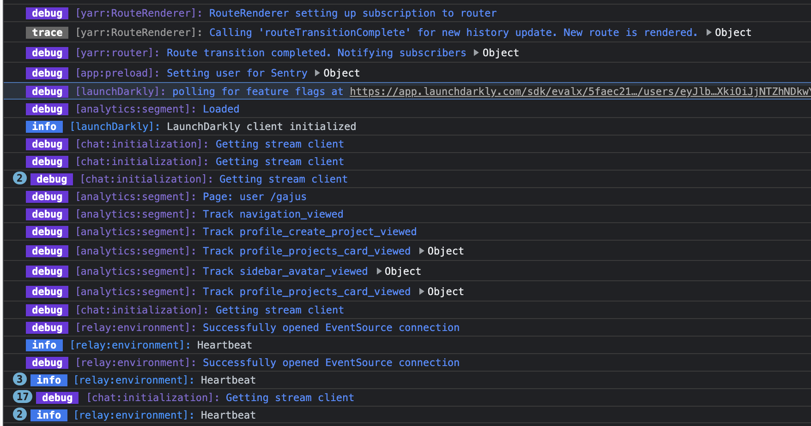

# Roarr Browser Log Writer

[](https://app.travis-ci.com/github/gajus/roarr-browser-log-writer)
[](https://coveralls.io/github/gajus/roarr-browser-log-writer)
[](https://www.npmjs.com/package/@roarr/browser-log-writer)
[](https://github.com/gajus/canonical)
[](https://twitter.com/kuizinas)

Roarr log writer for use in a web browser.



## Usage

Import the initialization code anywhere in your codebase, e.g.

```ts
import {
  createLogWriter,
} from '@roarr/browser-log-writer';

globalThis.ROARR = globalThis.ROARR ?? {};
globalThis.ROARR.write = createLogWriter();
```

Alternatively, import `@roarr/browser-log-writer/init`, which is equivalent to the above code.

```ts
import '@roarr/browser-log-writer/init';
```

If you are using Webpack, then consider using [lazy loading](https://webpack.js.org/guides/lazy-loading/), e.g.

```ts
import('@roarr/browser-log-writer/init');
```

## Displaying Logs

Logs are produced using `console.log`. However, by default, no logs are printed.

The simplest way to view all logs is to define `ROARR_LOG=true` [`localStorage`](https://developer.mozilla.org/en-US/docs/Web/API/Window/localStorage) value, i.e.

Type in console `localStorage.setItem('ROARR_LOG', 'true')` and refresh the page. Now you should see all the logs.

## Filtering Logs

By default all logs are displayed. However, you can narrow down logs using a special constant `ROARR_FILTER`.

The value of `ROARR_FILTER` is a [Liqe query](https://github.com/gajus/liqe), e.g.

```ts
# Only print logs with `context.logLevel` greater than 10.
localStorage.setItem('ROARR_FILTER', 'context.logLevel:>10')

# Only print logs with `context.namespace` containing "slonik".
localStorage.setItem('ROARR_FILTER', 'context.namespace:slonik')
```
